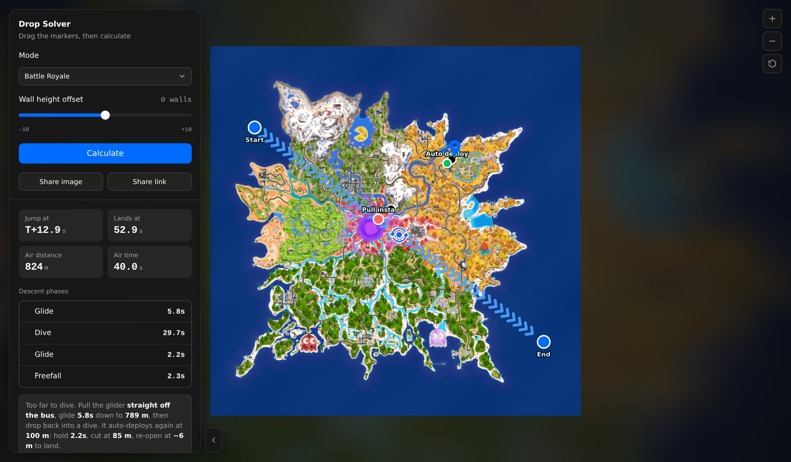

# Fortnite Drop Calculator

Stop guessing when to jump. Drop the bus route in, click where you want to
land, and get the exact jump point that puts you on the ground first.

**[Open it →](https://fwsoapy.github.io/fortnite-dropcalc/)**



## Why it's worth using

**It does the math instead of eyeballing it.** Optimal drops aren't intuition,
they're a solved problem: the bus moves at a fixed speed, freefall and dive have
fixed speeds, and there's exactly one jump point that minimises time to the
ground. This works it out for your route and your landing spot, every time.

**The numbers are real.** Every flight constant was measured in game with a
stopwatch, not copied off a wiki. The published numbers are wrong in ways that
actually cost you the drop, and this tool proved it in a live race: two players,
one bus, same landing spot. The wiki-style jump point lost by two seconds. The
measured one wins. Same story with OG glides, which were landing 25-30 m short
until the glider altitude got re-measured.

**It's fast.** Two markers, one click, one button. No account, no ads, no
tutorial.

**It works anywhere.** One HTML file, no dependencies. Save it and it runs off
`file://`, offline, with both island maps already inside. On a phone too, touch
drag included.

**It stays current by itself.** Each load pulls the live map and POI list from
the public Fortnite API, so a new season doesn't need a new version. Offline it
falls back to the built-in maps and everything still works.

**It's safe to use.** Manual input only. It never touches the running game: no
overlay, no screen capture, no memory reading, no game files, no traffic
inspection. Nothing to install, nothing to get you banned. Nothing you save
leaves your browser.

**Both modes, properly.** Battle Royale and OG each get their own island and
their own measured constants, because OG can't cut the glider and genuinely
flies differently. There's also a wall-height offset for landing on a roof or
dropping into a hole.

## Using it

Drag the **Start** and **End** markers onto the bus route, click where you want
to land, hit **Calculate**. You get the jump point, the time to land, and each
phase of the descent in order. Saved drops and folders stick around in the
browser.

## Under the hood

If you want the actual model, the constants, where each one came from, and where
the published figures fall apart, it's all written up:

- [docs/physics.md](docs/physics.md): the model and every measurement behind it,
  including one constant still unresolved and waiting on someone's stopwatch
- [docs/internals.md](docs/internals.md): how the page is built and how the maps
  get rebuilt each season

Short version on accuracy: the model rests on one person's hand-timed
measurements. They over-determine the model and they all hold at once, which no
web-sourced set managed, but it's still one person with a stopwatch. If you take
a measurement of your own there's an
[issue template](https://github.com/fwsoapy/fortnite-dropcalc/issues/new?template=measurement.yml)
for it.

## Running it yourself

Node 18 or newer, no dependencies.

```bash
git clone https://github.com/fwsoapy/fortnite-dropcalc
cd fortnite-dropcalc
npm run build       # writes drop-solver.html
npm test            # build, then all three suites
```

`drop-solver.html` isn't committed, since it's a 2 MB single file that's mostly
base64 map data. Build it, grab it from the
[releases](https://github.com/fwsoapy/fortnite-dropcalc/releases), or use the
hosted copy above.

## Credits and disclaimer

- Constants cross-checked against **dropmapsfn**, whose model is not adopted but
  which corroborated two figures and supplied one.
- Two published numbers (`3.84 m` per wall, re-open at `~6 m`) come from
  **NA Drops**.
- **technik-consulting.eu** for the bus speed and auto-deploy altitude, and for
  the rule of thumb that independently confirmed the jump lead.
- Violevo's [Fortnite-Drop-Calculator](https://github.com/Violevo/Fortnite-Drop-Calculator)
  was a visual reference. No code from it is in here.
- Map data from [fortnite-api.com](https://fortnite-api.com) and
  [fortnite.gg](https://fortnite.gg).

Not affiliated with, endorsed by, or connected to Epic Games. Fortnite and all
map art are Epic's property. This is a fan-made tool.

Code is [MIT](LICENSE).
